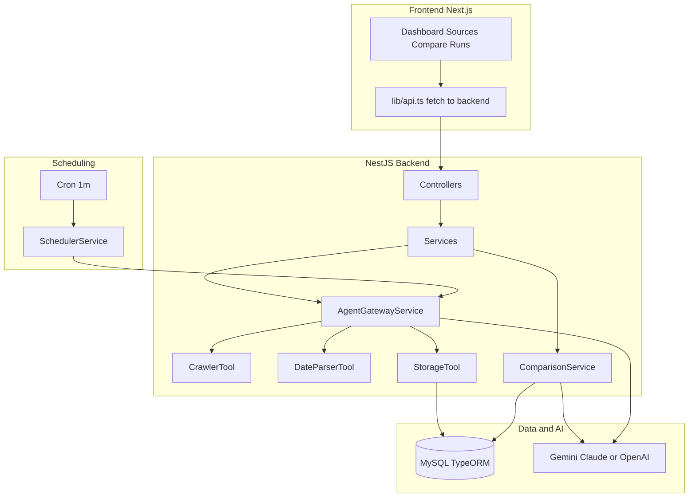
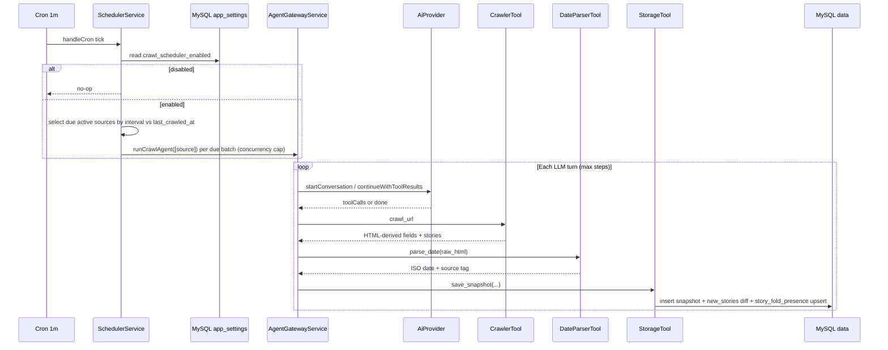

# FoldWatch — Technical presentation

A detailed overview of the **FoldWatch** monorepo for engineering demos and onboarding: what it does, how the backend and frontend fit together, and how data flows end to end.

---

## 1. What FoldWatch is

**FoldWatch** is an internal “news fold” intelligence tool. It:

1. **Tracks configured news homepages** (“sources”) — name, URL, crawl state.
2. **Periodically crawls** each source’s **first fold** (above-the-fold HTML): headline, summary, hero image, list of visible story links, embedded video hints.
3. **Persists snapshots** in MySQL with a **freshness score** derived from the best available date signal (or crawl time).
4. **Compares sources** with an **LLM-driven analysis**: freshness ranking, content quality, keywords, story overlap, matched topics, video presence, and a short verdict.

The product goal: **operational visibility** into how different sites present breaking news on the homepage — not a full article archive.

---

## 2. Repository layout (monorepo)

| Path | Role |
|------|------|
| `package.json` (root) | pnpm workspace scripts: `dev`, `dev:backend`, `dev:frontend`, `build` |
| `apps/backend/` | NestJS API (`PORT` default **3001**, global prefix **`/api`**) |
| `apps/frontend/` | Next.js 16 App Router UI (default **3000**) |

**Run locally**

- Backend: `pnpm dev:backend`
- Frontend: `pnpm dev:frontend` (set `NEXT_PUBLIC_API_URL` if the API is not `http://localhost:3001`)

---

## 3. High-level architecture

**Request path (typical)**

- Browser → Next.js → **direct `fetch`** to `NEXT_PUBLIC_API_URL/api/...` (see `apps/frontend/src/lib/api.ts`).
- Optional: `apps/frontend/src/app/api/[...proxy]/route.ts` exists for proxy patterns; the main dashboard uses the configured API base URL.

---

## 4. Backend (NestJS)

### 4.1 Core stack

- **Framework:** NestJS 10, Express.
- **ORM:** TypeORM + **MySQL** (`autoLoadEntities`, `synchronize: true` in dev — **not** ideal for production without migrations).
- **Scheduling:** `@nestjs/schedule` — cron every **1 minute** reads **`app_settings.crawl_scheduler_enabled`** and runs **in-process** crawls for **due** active sources (by `crawl_interval_minutes` vs `last_crawled_at`), with **`CRAWL_CONCURRENCY`** and a per-source in-flight lock. No Redis/BullMQ.
- **Scraping:** **Playwright** (Chromium) primary; **fetch + Cheerio** fallback.
- **AI:** Pluggable provider via `AI_PROVIDER`: `gemini` | `claude` | `openai`.

### 4.2 Application module graph

`AppModule` imports:

| Module | Responsibility |
|--------|------------------|
| `ConfigModule` | Env-driven config (`common/config/configuration.ts`) |
| `TypeOrmModule` | MySQL connection |
| `SettingsModule` | Global `app_settings` (e.g. `crawl_scheduler_enabled`) |
| `ScheduleModule` | Cron |
| `SourcesModule` | CRUD + pause + crawl-now + crawl interval PATCH |
| `SnapshotsModule` | Snapshots + compare endpoints + comparison AI |
| `AgentRunsModule` | Persist agent run + step audit trail |
| `AgentGatewayModule` | LLM agent orchestration + tools |
| `SchedulerModule` | Cron tick, in-process crawl dispatch, scheduler API |
| `DashboardModule` | Aggregated stats + crawl status |

### 4.3 Global HTTP behavior (`main.ts`)

- Prefix: **`/api`**
- **CORS:** `origin: '*'` (tighten for production).
- **ValidationPipe:** whitelist + transform.
- **HttpExceptionFilter** + **LoggingInterceptor** globally.

### 4.4 Configuration (environment)

Key variables (see `apps/backend/.env` locally):

| Area | Variables |
|------|-----------|
| Database | `DATABASE_HOST`, `DATABASE_PORT`, `DATABASE_NAME`, `DATABASE_USER`, `DATABASE_PASS` |
| App | `DEFAULT_CRAWL_INTERVAL_MINUTES` (`5` \| `15` \| `30`, default **30**) when creating a source without an interval |
| AI | `AI_PROVIDER`, provider-specific keys and models (`GEMINI_*`, `ANTHROPIC_*`, `OPENAI_*`) |
| Agent | `MAX_AGENT_STEPS` (default 15), `CRAWL_CONCURRENCY` (max parallel in-process source crawls per scheduler tick) |

### 4.5 Domain model (entities)

**`Source`** (`sources`)

- `id` (UUID), `name`, `url`
- `status`: `active` | `paused` | `error`
- `crawl_interval_minutes`: **5**, **15**, or **30** (default 30; validated on create/PATCH)
- `last_crawled_at`, `last_successful_at`, `failure_count`
- One-to-many **`Snapshot`**

**`Snapshot`** (`snapshots`)

- `source_id`, `headline`, `summary`, `hero_image_url`
- `published_at`, `modified_at`, `date_source`, `freshness_score`
- **`stories`**: JSON array `{ title, url?, keywords? }[]` (capped server-side, max **30**)
- **`new_stories`**: same shape — items not present in the **previous** snapshot for that source (first crawl: all stories)
- **`video_urls`**: string[]
- `extraction_failed`, `raw_meta`, `created_at`

**`AgentRun`** + **`AgentStep`** (`agent_runs`, `agent_steps`)

- Run: `task_type` (e.g. `crawl_sources`), `status`, token totals, summary, timestamps.
- Step: `step_number`, `type` (`think` | `tool_call` | `tool_result` | `final`), optional `tool_name`, `tool_input` / `tool_output`, `reasoning_text`, `tokens_used`.

**`ComparisonResult`** (`comparison_results`)

- `source_ids`, `source_names`, **`analysis`** (JSON blob matching `ComparisonAnalysis` shape).

**`AppSettings`** (`app_settings`)

- Singleton row (`id` = `default`): **`crawl_scheduler_enabled`** (master auto-crawl switch; persisted).

**`StoryFoldPresence`** (`story_fold_presence`)

- Per `source_id` + **`story_key`** (SHA-256 hex of the canonical URL/title key): **`first_seen_at`**, **`last_seen_at`** (tenure for “on fold since …”; digest keeps the unique index under MySQL’s key-length limit).

### 4.6 REST API surface (representative)

| Method | Path | Purpose |
|--------|------|---------|
| GET | `/api/sources` | All sources (+ latest snapshot where loaded) |
| POST | `/api/sources` | Create source |
| DELETE | `/api/sources/:id` | Remove source |
| PATCH | `/api/sources/:id/pause` | Toggle pause |
| PATCH | `/api/sources/:id/crawl-interval` | Set `crawl_interval_minutes` to **5**, **15**, or **30** |
| POST | `/api/sources/:id/crawl-now` | Start **single-source** in-process crawl (blocked if `crawl_scheduler_enabled` is false) |
| GET | `/api/snapshots/compare` | Latest snapshot **per source** (for compare cards) |
| POST | `/api/snapshots/compare-analysis` | Run LLM comparison for 2–3 `source_ids`; saves result |
| GET | `/api/snapshots/compare-history` | Paginated past comparisons |
| GET | `/api/snapshots/compare-analysis/:id` | Load one saved analysis |
| GET | `/api/snapshots/fold-summary?source_ids=` | Latest fold metrics + enriched stories (comma-separated UUIDs) |
| GET | `/api/snapshots/publish-velocity?source_ids=` | Historical **new_stories** counts + normalized rates (`window_hours`, `limit`) |
| GET | `/api/snapshots/:sourceId/history` | Snapshot history for one source |
| GET | `/api/agent-runs` | List runs |
| GET | `/api/agent-runs/:id` | Run detail |
| GET | `/api/agent-runs/:id/steps` | Step-by-step audit |
| GET | `/api/dashboard/stats` | KPIs + freshness + runs today + AI provider name |
| GET | `/api/dashboard/crawl-status` | **`scheduler_enabled`** (DB) + active run + last completed |
| GET | `/api/scheduler/status` | Auto-crawl enabled flag (**from DB**) |
| PATCH | `/api/scheduler/toggle` | Flip auto-crawl (**persisted**) |
| POST | `/api/scheduler/stop-crawl` | Set **`crawl_scheduler_enabled = false`** + abort in-flight runs (no queue) |
| POST | `/api/scheduler/run-all-now` | Queue crawl for **all active** sources not already in-flight; parallel batches up to **`CRAWL_CONCURRENCY`** (requires Auto-Crawl on) |

### 4.7 Crawl pipeline (scheduler → agent → tools)

**Important behaviors**

1. **Single-source “Run Now” in the header** (`layout.tsx`) currently POSTs **`/sources/{firstSourceId}/crawl-now`** — so it only queues the **first** source in the list, not all sources. Per-source “crawl” buttons on the Sources page (if present) are the right place for targeting one site explicitly.

2. **Agent is tool-calling, not a single prompt:** the model decides the order of `crawl_url` → `parse_date` → `save_snapshot` per source (within step limits). Runs may interleave sources across turns.

3. **`CrawlerTool`**
   - Loads page with Playwright (`domcontentloaded` + short wait), else fetch.
   - Extracts OG/title meta, hero image, truncated body HTML for date parsing.
   - **Story extraction:** heading-based pass + **anchor-based pass** with `isLikelyArticleLink()` to drop section hubs (e.g. `/videos`) and keep article-like URLs (TOI `articleshow` / `liveblog`, Times Now `-article-123`, deep paths, etc.).
   - **Videos:** `video`, `iframe` embeds, OG video meta.

4. **`DateParserTool`**
   - Prefers structured signals; may fall back to **crawl timestamp** when nothing trustworthy is found (hence DEBUG logs like “using crawl timestamp”).

5. **`StorageTool` / `SnapshotsService.create`**
   - Caps stories at 30.
   - Recomputes **freshness_score** from `modified_at` at save time.
   - Computes **`new_stories`** vs the previous latest snapshot; upserts **`story_fold_presence`** for tenure.

### 4.8 Agent gateway resilience (production-relevant)

**Problem:** LLMs often send `stories` / `video_urls` as **stringified JSON** that is **not valid JSON** (bad escapes, quotes inside titles, etc.). That used to yield **`stories: null`** in MySQL even when the crawl succeeded.

**Mitigations in `AgentGatewayService`:**

1. **`parseJsonField`:** If value is a string, sanitize common Gemini issues (e.g. `\'` → `'`) and `JSON.parse`; failures logged at **debug**.
2. **Per-run crawl cache (`crawlCachesByRunId`):** On successful `crawl_url`, store `stories` and `video_urls` keyed by `source_id`. On `save_snapshot`, if parsed arrays are missing or empty, **merge from cache** so the DB always reflects the crawler output. Keywords can be derived from titles when the model omits them.
3. **`GeminiProvider`:** If the API returns a candidate with **no `content`** (safety / empty completion), avoid crashing on `content.parts`; return a terminal turn with a short reason string instead of throwing.

### 4.9 Comparison service

`ComparisonService.analyze(sourceIds)`:

1. Loads **latest snapshots** for the selected sources (`SnapshotsService.getLatestForSources` → enriched with tenure via compare query + `attachTenureToSnapshot`).
2. Builds a large prompt with JSON snapshot payloads (headline, summary, **stories[]** with **`first_seen_at`** / **new** flags, **`new_since_last_crawl_count`**, **video_urls[]**, freshness, dates) plus **fold summary** and **publishing velocity** metrics (normalized by crawl interval).
3. Calls **`startConversation`** with **no tools** — pure JSON response from the model.
4. Parses JSON (strips accidental markdown fences); fills fallbacks for `story_comparison`, `matched_stories`, `video_comparison` if missing.
5. Persists full **`ComparisonResult.analysis`** for history replay.

**Matching logic (fallback):** token overlap similarity between titles across sources when the model omits `matched_stories`.

---

## 5. Frontend (Next.js)

### 5.1 Stack

- **Next.js 16** (App Router), **React 19**
- **Tailwind CSS 4**, **shadcn-style** UI primitives (`components/ui/*`)
- **lucide-react** icons, **recharts** on dashboard charts
- **Client-heavy** dashboard: `'use client'` on layout and main pages

### 5.2 Routes (`apps/frontend/src/app/(dashboard)/`)

| Route | File | Role |
|-------|------|------|
| `/` | `page.tsx` | Overview / dashboard stats + charts |
| `/sources` | `sources/page.tsx` | Manage sources, crawl triggers, table |
| `/compare` | `compare/page.tsx` | Pick 2–3 sources, run AI compare, history |
| `/runs` | `runs/page.tsx` | Agent run list and drill-down |

**Layout** (`layout.tsx`)

- Sidebar navigation.
- Header: **crawl status** (polls `/dashboard/crawl-status` every 10s), **scheduler toggle**, **Stop Crawl**, **Run Now** (queues first source only — see backend note).

### 5.3 API client (`lib/api.ts`)

- `API_BASE = NEXT_PUBLIC_API_URL || http://localhost:3001`
- Requests hit **`${API_BASE}/api${path}`** with `cache: 'no-store'`.
- Typed interfaces: `Source`, `Snapshot`, `AgentRun`, `ComparisonAnalysis`, `CrawlStatus`, `DashboardStats`, etc.
- Errors: throws with `json.error.message` when present.

### 5.4 Compare UI (mental model)

1. **GET `/snapshots/compare`** → one latest snapshot per source (sorted by freshness in the service).
2. **`FoldCard`:** hero, headline, summary, recency badge, **always shows story count** (0+), videos badge, `date_source`.
3. **`AnalysisPanel`:** renders `ComparisonAnalysis` sections (freshness ranking, content analysis, keywords, story comparison, matched stories, videos, verdict).

### 5.5 Styling and UX conventions

- Dark/light friendly utility classes (`muted`, `primary`, etc.).
- Loading skeletons and inline spinners for long AI compares.
- Compare selection capped at **3** sources (backend enforces 2–3 for analysis).

---

## 6. End-to-end data lifecycle (talk track)

1. **Define sources** — editor adds TOI, Times Now, etc.
2. **Crawl** — scheduler or manual job enqueues work; worker runs **agent**.
3. **Agent** — model calls tools; **crawler** produces canonical story list; **date parser** sets time context; **storage** writes **Snapshot** rows.
4. **Dashboard** — stats and charts reflect latest snapshots and run activity.
5. **Compare** — user selects sources; backend sends snapshot payloads to LLM; structured JSON returned and stored; UI renders narrative + structured widgets.

---

## 7. Operations and limits (honest slide)

| Topic | Note |
|-------|------|
| **DB schema** | `synchronize: true` is convenient in dev; use migrations for prod. |
| **Secrets** | API keys only in env / secret store — never commit `.env`. |
| **Rate limits** | Crawls + LLM calls cost money; agent steps are capped. |
| **Single vs all sources** | Header “Run Now” only triggers first source’s crawl job; document or fix if “crawl everything” is expected. |
| **LLM fragility** | Comparison and agent tool *arguments* are JSON-shaped; server-side crawl cache mitigates bad `save_snapshot` payloads for stories. |
| **Playwright** | Requires browser binaries in deploy environment. |

---

## 8. File map (quick reference)

**Backend**

- `src/agent/agent-gateway.service.ts` — agent loop, tools, parse/cache merge.
- `src/agent/tools/*.ts` — crawl, date, storage, alert.
- `src/agent/providers/*.ts` — Gemini / Claude / OpenAI adapters.
- `src/snapshots/snapshots.service.ts` — snapshot CRUD, latest-for-compare query, freshness recompute.
- `src/snapshots/comparison.service.ts` — compare prompt + parse + fallbacks.
- `src/scheduler/scheduler.service.ts` — cron, queue, processor, stop crawl.

**Frontend**

- `src/lib/api.ts` — HTTP + types.
- `src/app/(dashboard)/layout.tsx` — shell + crawl controls.
- `src/app/(dashboard)/compare/page.tsx` — compare flow.
- `src/components/compare/fold-card.tsx`, `analysis-panel.tsx` — presentation.

---

## 9. Suggested demo script (5–10 minutes)

1. Show **Sources** — two news homepages configured.
2. Trigger a **crawl** (per source or explain header behavior).
3. Open **Agent Runs** — expand steps: `crawl_url` → `parse_date` → `save_snapshot`.
4. Show **Compare** — select two sources, **Analyze**, walk through freshness + story overlap.
5. Mention **crawl cache**: even if the model sends broken JSON for stories, **snapshots stay populated** from the crawler.

---

*Document generated for the FoldWatch codebase. Update paths and behavior if the repo evolves.*
